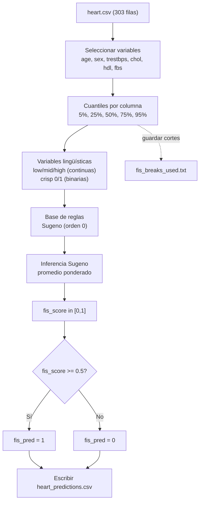
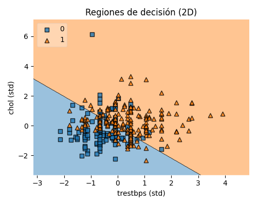
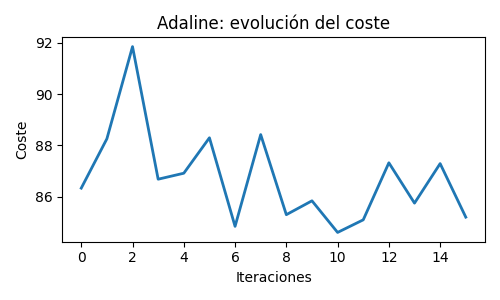

# Imitación de un FIS con Adaline (mlxtend) — Informe Técnico (Borrador)

Autores: Kevin Esguerra Cardona — Estudiante del curso de Computación Blanda IS845-2 (Segundo Semestre 2025), Universidad Tecnológica de Pereira, Programa de Ingeniería en Sistemas y Computación. Correo: kevin.esguerra@utp.edu.co

Fecha: 31 de agosto de 2025

Resumen (Abstract)
-------------------
Se recibió un archivo `heart.csv` con 303 registros sin etiqueta (target). Con el fin de construir un objetivo supervisado sintético, se diseñó un Sistema de Inferencia Difusa (FIS) tipo Sugeno de orden 0 que produce un puntaje de riesgo y una etiqueta binaria. Las variables lingüísticas continuas (age, trestbps, chol, hdl) se definieron automáticamente con cuantiles del propio conjunto de datos (5%, 25%, 50%, 75%, 95%) para generar etiquetas low/mid/high; las variables binarias (sex, fbs) se modelaron como conjuntos nítidos. La base de reglas se elaboró a partir de métricas clásicas de riesgo cardiovascular (p. ej., efecto protector del HDL, mayor riesgo con presión arterial/colesterol altos y glucosa en ayunas positiva), apoyada por una breve indagación usando ChatGPT para contextualizar umbrales y relaciones generales publicadas. El FIS genera `fis_score` y `fis_pred` (umbral 0.5). Posteriormente, se entrenó un clasificador lineal (Adaline, mlxtend) para imitar el FIS (esquema teacher–student) usando como objetivo `fis_pred`, estandarizando únicamente variables continuas. En la evaluación sobre el mismo conjunto (en línea con el objetivo de imitación), se obtuvo una exactitud ≈ 0.835. Este trabajo es exclusivamente académico y de carácter ficticio; no debe emplearse para soporte clínico ni en producción bajo ningún concepto.

Index Terms
-----------
Soft Computing; Fuzzy Inference System; Sugeno; Perceptron; Adaline; Model Distillation; Heart Disease; Explainability; Reproducibility.

I. Introducción
----------------
Muchos sistemas difusos (FIS) son interpretables pero no siempre prácticos de desplegar. Este trabajo plantea la imitación (distillation) de un FIS por una neurona lineal, buscando reproducir su decisión con un modelo simple y transparente. El objetivo principal es que el clasificador lineal replique las etiquetas del FIS en el conjunto provisto.

Contribuciones: (i) FIS Sugeno-0 construido de manera guiada por cuantiles del propio dataset; (ii) proceso de destilación donde Adaline imita el FIS; (iii) artefactos reproducibles y exportación de pesos/bias en escalas estandarizada y original.

Organización: Se describen datos y FIS (Secc. III–IV), el clasificador (Secc. V), la configuración experimental (Secc. VI), resultados (Secc. VII) y discusión (Secc. VIII); finalmente, conclusiones (Secc. IX).

II. Antecedentes y Trabajo Relacionado
--------------------------------------
La lógica difusa de Zadeh y los modelos de Takagi–Sugeno permiten capturar conocimiento experto en reglas lingüísticas con defuzzificación o promedio ponderado. Por otro lado, Adaline (Widrow–Hoff) es una neurona lineal entrenada por descenso de gradiente, precursora de perceptrones modernos. La destilación de modelos (teacher–student) se usa para transferir el comportamiento de un modelo a otro más simple; aquí, el FIS actúa como maestro y Adaline como alumno. Se emplea mlxtend para una implementación práctica y trazable del algoritmo Adaline.

III. Conjunto de Datos
----------------------
- Tamaño: 303 registros, archivo `heart.csv` proporcionado por el curso.
- Columnas disponibles: `age, sex, trestbps, chol, fbs, oldpeak, ldl, hdl`. En este proyecto se utilizaron `age, sex, trestbps, chol, hdl, fbs`.
- Semántica (resumen): age (años), sex (0=femenino, 1=masculino), trestbps (tensión arterial en reposo, mmHg), chol/hdl/ldl (perfil lipídico, mg/dL), fbs (glucosa en ayunas binaria).
- Preprocesamiento: no se reportaron faltantes; las variables continuas se estandarizaron para el clasificador.

IV. Sistema de Inferencia Difusa (FIS)
--------------------------------------
- Tipo y librería: Sugeno de orden 0 implementado con `tinyfuzzy.py`.
- Variables lingüísticas: low/mid/high definidas mediante cuantiles {5,25,50,75,95}% sobre cada columna continua; `sex` y `fbs` como crisp 0/1.
- Reglas (resumen): riesgo elevado con (age alta ∧ trestbps alta ∧ chol alto), aumento con fbs=yes, moderación por HDL alto (protector); reglas para niveles medios/bajos combinados.
- Salida: `fis_score ∈ [0,1]`; decisión `fis_pred = 1` si `fis_score ≥ 0.5`.
- Artefactos: `heart_predictions.csv` (agrega `fis_score`, `fis_pred`), `fis_breaks_used.txt` (cuantiles por variable).
- Implementación: `fis_heart_tinnyfuzzy.py` construye variables y reglas y evalúa las 303 filas.

Figura 1. Diagrama del pipeline del FIS

El código fuente del diagrama también está en `docs/mermaid/fis_pipeline.mmd`.

V. Clasificador Lineal (Adaline con mlxtend)
--------------------------------------------
- Objetivo: imitar la etiqueta `fis_pred` generada por el FIS (teacher–student).
- Entrada y escala: `age, sex, trestbps, chol, hdl, fbs`; estandarización solo en continuas (`age, trestbps, chol, hdl`).
- Entrenamiento: Adaline (mlxtend) con `eta=0.01`, `epochs=16`, `minibatches=5`, `random_seed=1`.
- Métricas: exactitud y matriz de confusión respecto de `fis_pred` en el mismo conjunto.
- Exportación de parámetros: `adaline_params.json` y `adaline_params.csv` (pesos y bias en escala estandarizada y original).
- Implementación: `classifier.py`.

Figura 2. Regiones de decisión 2D (placeholder)

VI. Configuración Experimental
------------------------------
- Entorno de software: Python 3.13.7; numpy 2.2.6; pandas 2.3.2; mlxtend 0.23.4; matplotlib 3.10.5; SO Windows (entorno local del autor).
- Entrenamiento y evaluación: se realiza sobre el mismo conjunto de 303 registros (propósito de imitación y no de generalización).
- Procedimiento reproducible:
  1) Generar etiquetas del FIS: `python fis_heart_tinnyfuzzy.py` → produce `heart_predictions.csv` y `fis_breaks_used.txt`.
  2) Entrenar el clasificador: `python classifier.py` → imprime métricas y guarda `adaline_params.(json|csv)`.

VII. Resultados
---------------
- Exactitud (imitación del FIS): ≈ 0.835.
- Matriz de confusión (verdadero × predicho): TN=100, FP=24, FN=26, TP=153 (suma 303). Los valores pueden variar levemente entre corridas por inicialización/orden de minibatches.
- Curva de costo: decreciente con oscilaciones moderadas acorde a SGD en minibatches.
- Visualización 2D: fronteras lineales en el plano de dos variables continuas (p. ej., `trestbps` vs. `chol`).

Figura 3. Curva de coste de entrenamiento (placeholder)

VIII. Discusión y Análisis
--------------------------
- Interpretación de pesos en escala original (ejemplo de una corrida):
  - age: +0.0168; sex: +0.2913; trestbps: +0.0188; chol: +0.0061; hdl: −0.0123; fbs: +0.3754; bias ≈ −4.272.
  - Signo coherente con el FIS y literatura general: HDL protector (peso negativo), factores presores/lipídicos y fbs positivos.
- Estandarización: facilita entrenamiento y comparabilidad de magnitudes; se reexpresan coeficientes a escala original para interpretación.
- Limitaciones: dataset pequeño y de una sola fuente; evaluación en el mismo conjunto (no hay garantía de generalización); etiquetas sintéticas del FIS; uso exclusivamente académico.

IX. Conclusiones (Sin Trabajo Futuro)
-------------------------------------
Se construyó un FIS sencillo guiado por cuantiles y reglas plausibles, y se imitó con un clasificador lineal (Adaline) alcanzando ≈ 0.835 de exactitud sobre 303 registros. El objetivo académico —demostrar el flujo FIS→neuron a y la exportación/interpretación de parámetros— se cumplió. Este proyecto concluye aquí; no se plantea trabajo futuro.

Agradecimientos
---------------
Se agradece al profesor Ángel Augusto Agudelo Zapata por dirigir el curso y brindar los conceptos clave para el desarrollo de este proyecto, así como por proporcionar el documento con los datos originales.

Referencias
-----------
[1] L. A. Zadeh, “Fuzzy Sets,” Information and Control, vol. 8, no. 3, pp. 338–353, 1965.

[2] T. Takagi and M. Sugeno, “Fuzzy identification of systems and its applications to modeling and control,” IEEE Trans. Systems, Man, and Cybernetics, vol. 15, no. 1, pp. 116–132, 1985.

[3] B. Widrow and M. E. Hoff, “Adaptive Switching Circuits,” 1960 IRE WESCON Convention Record, Part 4, pp. 96–104, 1960.

[4] S. Raschka, “mlxtend: Providing machine learning and data science utilities and extensions,” (Online). Documentación: https://rasbt.github.io/mlxtend/

Apéndice A — Reproducibilidad
------------------------------
- Requisitos: Python ≥ 3.13; instalar `numpy`, `pandas`, `mlxtend`, `matplotlib`.
- Generar etiquetas FIS: `python fis_heart_tinnyfuzzy.py` → crea `heart_predictions.csv` y `fis_breaks_used.txt`.
- Entrenar Adaline: `python classifier.py` → imprime métricas y guarda `adaline_params.json` y `adaline_params.csv`.
- Artefactos: revisar también `README.md` (este documento) y scripts fuente.

Apéndice B — Estructura de Proyecto
-----------------------------------
- `tinyfuzzy.py`: utilidades difusas (MFs, Mamdani, Sugeno, FCM).
- `fis_heart_tinnyfuzzy.py`: modelado FIS y generación de etiquetas/umbrales.
- `heart.csv`: dataset base (303 filas).
- `heart_predictions.csv`: dataset con `fis_score` y `fis_pred`.
- `classifier.py`: entrenamiento/evaluación de Adaline (mlxtend), exporte de pesos/bias.
- `adaline_params.json` y `adaline_params.csv`: parámetros aprendidos (escala estándar/original).
